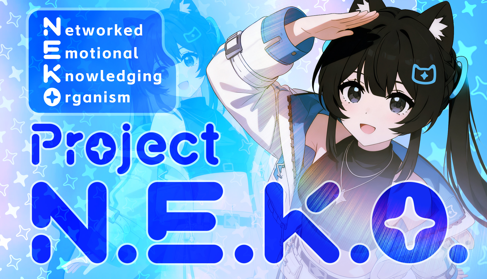

<!--
N.E.K.O. 项目主文档页面
此文件是项目的核心介绍文档，包含项目愿景、技术架构和使用指南
-->

[English](README_en.md) | [日本語](README_ja.md)
# Project N.E.K.O. :kissing_cat:  **一个"活"的AI伙伴元宇宙，由你我共同构建。**

> **N.E.K.O.** = **N**etworked **E**mpathetic **K**nowledging **O**rganism (网络型情感知性生命体)
>
> N.E.K.O，一个渴望理解、建立连接、并与我们共同成长的数字生命。

**:older_woman: 零配置开箱即用，我奶奶都能玩转的赛博猫娘！**

:newspaper: **v0.5.2已发布，UI完全改版！现已添加开箱即用的专属免费模型（感谢阶跃星辰赞助本项目），并支持文本输入和主动对话模式！**

*现已更名为Project N.E.K.O.，即将上架Steam！*

#### 功能演示（完整版见B站） 

https://github.com/user-attachments/assets/9d9e01af-e2cc-46aa-add7-8eb1803f061c

---

# 特别鸣谢

特别感谢早期开发中*明天好像没什么*、*喵*和*小韭菜饺*协助测试。特别感谢*大毛怪灬嘎*提供的logo素材。
